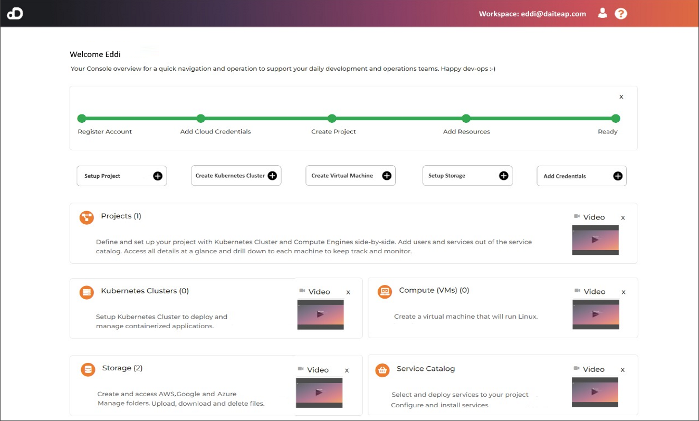

## Daiteap Cloud Solutions

Daiteap is an open-source No-Code platform which enables developers and IT professionals to <b>automtaically create an manage Kubernetes Clusters with Longhorn Storage, Virtual Machines and S3 compatible Storage </b> in an easy and integrated fasion. The platform offers the following advantages:

- Web UI to manage multi-cloud resources and environments across a range of public and private cloud providers
- Ability to create multi-cloud Kubernetes and Compute clusters where one cluster spans across multiple cloud providers
- API to manage different cloud providers without needing to integrate each provider separately
- CLI tool to automate and integrate cloud ressources into existing systems and automation scripts

## Getting Started ##

<b>Go to [daiteap-platform](https://github.com/Daiteap/daiteap-platform) repository and follow the instructions. </b>

Also visit our website [daiteap.com](https://www.daiteap.com/) for further information.
